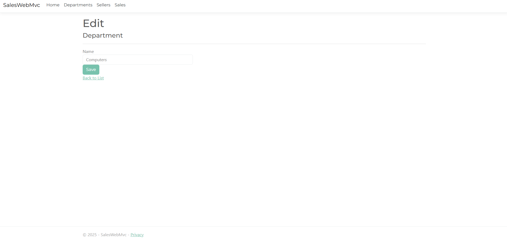

# Sistema de Gestão de Vendedores e Departamentos

Sistema web desenvolvido em **ASP.NET Core** para gerenciar vendedores e departamentos, com funcionalidades completas para cadastro, edição, exclusão e visualização de vendas.

## Funcionalidades

- Cadastro de departamentos e vendedores
- Edição e exclusão de registros
- Registro de vendas associadas a vendedores
- Filtro de vendas por período e por departamento
- Banco de dados relacional para armazenamento seguro e eficiente dos dados

## Tecnologias Utilizadas

- ASP.NET Core
- Entity Framework Core
- SQL Server / MySQL (configuração flexível para diferentes bancos)
- Bootstrap (para estilização responsiva e moderna)

## Telas do Sistema

### Página Inicial  

### Página de Vendedores  

### Página de Edição de Vendedores  

### Página de Departamentos  

### Página de Edição de Departamentos  

